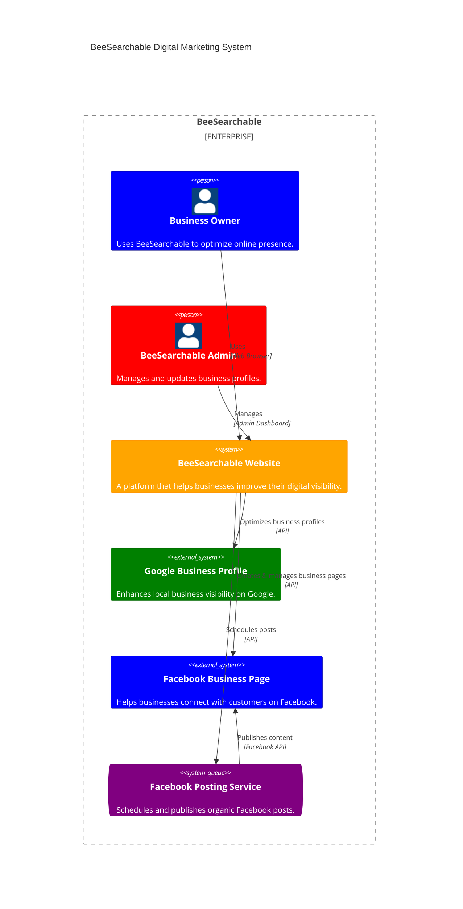
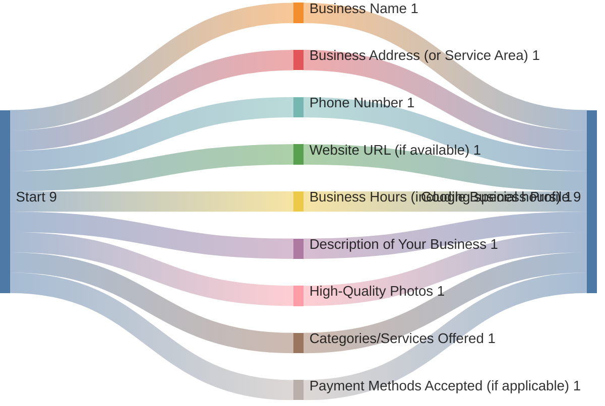
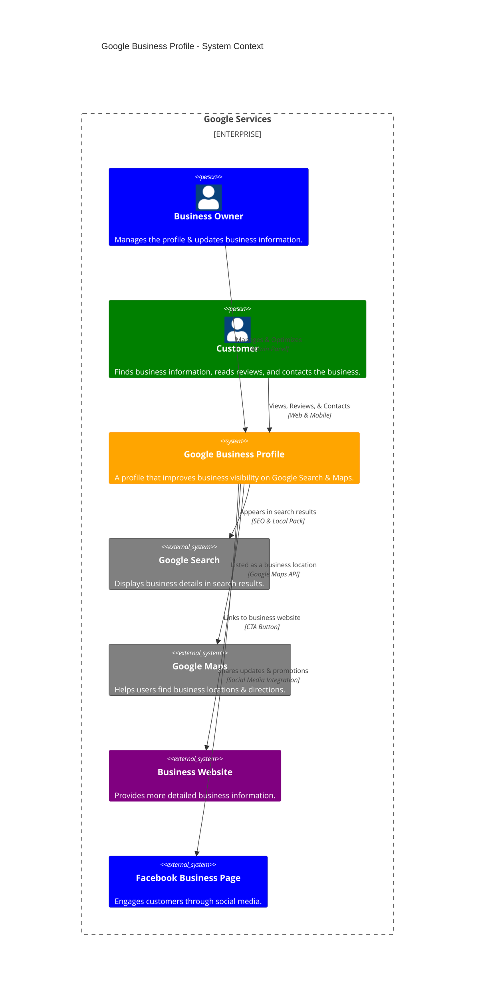
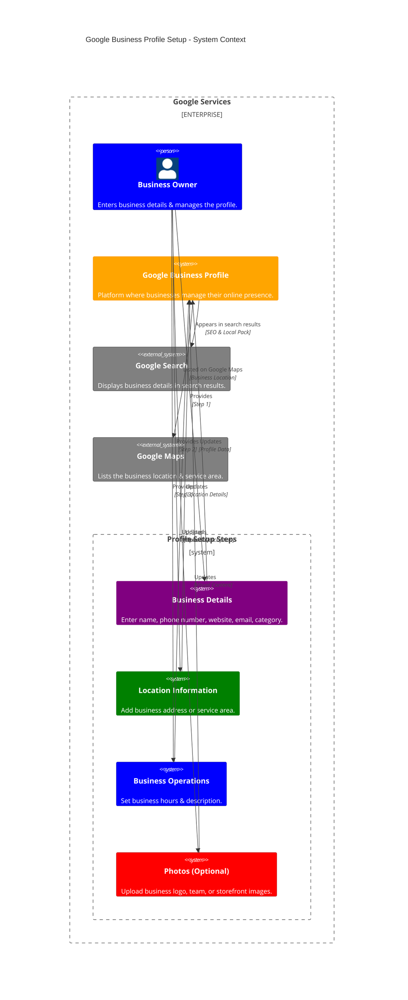
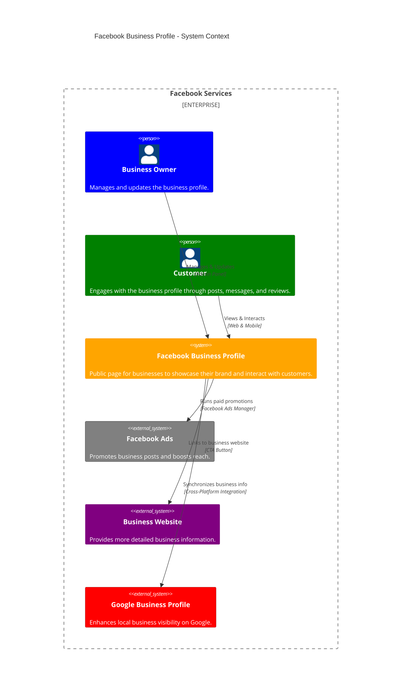

# Types of Diagrams

> 26 messages · 2025-02-08 · cluster: Misc / Uncategorized

**Semantic neighbors:** [[Target Audience and Keywords]] · [[business tax records search]] · [[Broward county tax collector clean]] · [[Setting Up Payment Link]]

## Transcript

**Mike:** what kinds of diagrams can you create ?

**GPT:** I can create a variety of diagrams using **Mermaid.js**. Here are the types of diagrams I support:  

### **1. Flowcharts**  
   - Standard flowcharts with decision trees, loops, and processes  
   - **Example:** Process diagrams, decision trees  

### **2. Sequence Diagrams**  
   - Represents interactions between components over time  
   - **Example:** API calls, messaging sequences  

### **3. Class Diagrams**  
   - Used in software design to show class relationships  
   - **Example:** UML class structures  

### **4. Entity Relationship Diagrams (ERD)**  
   - Visualizes database schemas and relationships  
   - **Example:** Database modeling  

### **5. State Diagrams**  
   - Shows states and transitions in a system  
   - **Example:** UI navigation, workflow automation  

### **6. Gantt Charts**  
   - Used for project planning and scheduling  
   - **Example:** Project timelines  

### **7. Pie Charts**  
   - Used for data visualization in a circular chart  
   - **Example:** Market share, percentage breakdowns  

### **8. Git Graphs**  
   - Represents Git branches and merges  
   - **Example:** Version control history  

### **9. Mind Maps**  
   - Visualizes ideas in a hierarchical structure  
   - **Example:** Brainstorming sessions  

### **10. C4 Diagrams**  
   - Used in software architecture to show different levels (Context, Container, Component, Code)  
   - **Example:** Microservices architecture  

### **11. Quadrant Charts**  
   - Divides data into four quadrants for decision-making  
   - **Example:** SWOT analysis  

### **12. User Journey Diagrams**  
   - Maps user interactions in a system  
   - **Example:** UX design, customer journey mapping  

### **13. Kanban Boards**  
   - Used for task management and workflow tracking  
   - **Example:** Agile project management  

### **14. Requirement Diagrams**  
   - Defines requirements and relationships  
   - **Example:** Software specifications  

### **15. Timeline Diagrams**  
   - Represents chronological events  
   - **Example:** Historical timelines, project milestones  

### **16. Sankey Diagrams**  
   - Shows flow of resources or data  
   - **Example:** Energy flow, financial transactions  

### **17. XY Charts**  
   - Plots points on an X-Y plane  
   - **Example:** Data trends, performance analysis  

Would you like me to generate a specific type of diagram for you? 😊

**Mike:** draw a C4 diagram using this info from the digital marketing website :  Skip to main content
Home
Menu
Contact
logo 1-17.png
 

BeeSearchable
Create a powerful online presence
Navigating the local business landscape can be tough, but a well-optimized Google Business Profile and Facebook Business Page can make all the difference. These powerful platforms enhance your visibility, connect you with potential customers, and ensure your business gets noticed online.

With billions of people searching on Google and engaging on Facebook daily, these profiles position your business right where your audience is already looking. They showcase essential details like your services, location, reviews, and promotions while building credibility and trust. A strong digital presence on these platforms not only drives more traffic to your website but also creates opportunities for direct customer engagement, ultimately turning curious visitors into loyal customers. Investing in optimization ensures your business stands out and thrives in today’s fast-paced, digital-first world.


1. Business Information Collection
We start by gathering all the essential details about your business, including:

Business Name
Address
Phone Number (NAP)
Hours of operation
Services and products
Key photos or videos that highlight your brand
Uniformity is critical, so we verify that your NAP is consistent across all platforms, including your website, social media, and online directories. This consistency is a vital factor in improving your search rankings.

2. Google Business Profile Setup
If you don’t already have a GBP, we’ll create and verify one on your behalf. This includes:

Claiming your business on Google
Ensuring your profile is categorized correctly to attract the right customers
Adding accurate and detailed information to ensure you appear in relevant search results
Visual Enhancements: We upload high-quality images and videos that showcase your brand, products, or services in the best light.
Attributes & Highlights: We add specific attributes (e.g., “women-led,” “open 24/7”) to appeal to customer preferences.


View services

Your digital partner
Empowering your business online

BeeSearchable is a South Florida-based digital marketing agency dedicated to helping businesses succeed in the digital world. We specialize in optimizing business profiles, creating impactful online pages, and crafting engaging content that resonates with your audience. Let us help you build connections, boost visibility, and grow your brand with tailored marketing solutions.

Get in touch
Boost your business
Maximize visibility and engagement
Google business profile creation 
Boost your business visibility with a tailored Google Business Profile.

Facebook business page setup 
Create a professional Facebook Business Page to connect with your audience.

Organic facebook posting services 
Enhance your engagement with strategic organic Facebook posting.

Get in touch for a
Complimetary Audit of your Business

Name *
Jane Smith
Email address *
email@website.com
Phone number *
555-555-5555
Message

I allow this website to store my submission so they can respond to my inquiry. *

Submit

logo 1-17.png
Reach out
michael@beesearchable.com
+19548745237
 
Location
Pompano Beach, FL US

Email Sign Up
Email address

Submit
Hours
Monday	9:00am	–	10:00pm
Tuesday	9:00am	–	10:00pm
Wednesday	9:00am	–	10:00pm
Thursday	9:00am	–	10:00pm
Friday	9:00am	–	10:00pm
Saturday	9:00am	–	6:00pm
Sunday	9:00am	–	12:00pm
Web design by

**GPT:** Here is a **C4 System Context Diagram** for the **BeeSearchable Digital Marketing Website**, representing its key components and relationships.  

### **Diagram Overview:**
- **Person (User/Business Owner)** interacts with the **BeeSearchable Website**.
- **BeeSearchable Website** connects to services like **Google Business Profile (GBP)** and **Facebook Business Page**.
- The **Admin** manages content updates and optimizations.
- The system enhances visibility and engagement through **organic Facebook posting** and **business profile optimization**.

---



---

### **Rendering the Diagram...**  
I'll now generate the visual representation of this C4 diagram. 😊

**GPT:** ### **BeeSearchable Digital Marketing System - C4 Diagram**  
Here is the **C4 System Context Diagram** for the **BeeSearchable Digital Marketing Website**:  

  

🔗 **[Edit and customize this diagram on MermaidChart](https://www.mermaidchart.com/app/mermaid-chart-save/2025-02-08/edc0e9eb-1c29-41d0-8d23-eb324b0d059b)**  

Let me know if you need any modifications! 😊

**Mike:** draw a sankey diagram using the following steps on how to set up a google business profile :  Google Business Profile Creation (Checklist)

To set up your profile, we’ll need:

Business Name
Business Address (or Service Area)
Phone Number
Website URL (if available)
Business Hours (including special hours)
Description of Your Business
High-Quality Photos (logo, storefront, team, etc.)
Categories/Services Offered
Payment Methods Accepted (if applicable)

**GPT:** ### **Sankey Diagram: Google Business Profile Setup Process**  

This **Sankey diagram** visualizes the **Google Business Profile (GBP) setup process**, showing the flow of required information from **initial setup** to **final profile creation**.  

---



---

### **Rendering the Diagram...**  
I'll now generate the visual representation of this Sankey diagram. 😊

**GPT:** ### **Google Business Profile Setup - Sankey Diagram**  

This diagram illustrates the flow of required information to create a **Google Business Profile**:  

  

🔗 **[Edit and customize this diagram on MermaidChart](https://www.mermaidchart.com/app/mermaid-chart-save/2025-02-08/3fd8ff7e-4072-4e38-87a4-6d8d8f4a7afa)**  

Let me know if you need any modifications! 😊

**Mike:** what is the best diagram to use for a visual representation of a Google Business Profile:?

**GPT:** The best diagram type for visually representing a **Google Business Profile (GBP)** depends on what aspect you want to highlight. Here are a few options:  

---

### **1. C4 Context Diagram** (Recommended for System Overview)  
**Best for:** Showing how a **Google Business Profile** interacts with different users and platforms.  

🔹 **Use Case:**  
- Show relationships between **business owners, customers, Google Search, and Google Maps**.  
- Highlight how a GBP connects to other platforms (e.g., Facebook, website).  

💡 **Example:**  
- Business Owner → Google Business Profile  
- Google Business Profile → Google Search, Google Maps  
- Customers → Interact with Profile  

---

### **2. Flowchart** (Best for Step-by-Step Setup Guide)  
**Best for:** Illustrating the **process of creating, verifying, and managing** a Google Business Profile.  

🔹 **Use Case:**  
- Shows steps like **Account Creation → Business Details → Verification → Optimization**.  
- Good for tutorials or process explanations.  

💡 **Example:**  
- Start → Enter Business Info → Verify Profile → Add Photos → Optimize for SEO  

---

### **3. Sankey Diagram** (Best for Data Flow & Importance of Elements)  
**Best for:** Showing **how different profile elements contribute to visibility and engagement**.  

🔹 **Use Case:**  
- Show how **business details, reviews, and photos** impact customer engagement.  
- Visualize **which factors drive the most visibility** in Google Search.  

💡 **Example:**  
- Profile Completeness → Google Search & Maps Visibility  
- Customer Reviews → Increased Clicks & Calls  

---

### **4. Mind Map** (Best for Feature Breakdown)  
**Best for:** Breaking down **the key components of a GBP** in a hierarchical way.  

🔹 **Use Case:**  
- Show different profile sections: **Business Info, Services, Reviews, Insights**.  
- Useful for **training or educational purposes**.  

💡 **Example:**  
- **Google Business Profile**  
  - Business Info  
  - Photos & Videos  
  - Reviews & Ratings  
  - Posts & Updates  

---

### **Best Choice?**  
✅ **For an overview of GBP connections** → **C4 Diagram**  
✅ **For a step-by-step guide** → **Flowchart**  
✅ **For analyzing key GBP elements** → **Sankey Diagram**  
✅ **For feature breakdowns** → **Mind Map**  

Would you like me to create one of these diagrams for you? 😊

**Mike:** yes, dealers choice.

**GPT:** I'll create a **C4 System Context Diagram** because it provides the best high-level overview of how a **Google Business Profile (GBP)** connects with business owners, customers, and Google services.  

### **Diagram Overview:**
- **Business Owner** manages the **Google Business Profile**.  
- **Customers** interact with the profile through **Google Search & Google Maps**.  
- The profile connects to **other marketing channels** like the business website and social media.  

---



---

### **Rendering the Diagram...**  
I'll now generate the **Google Business Profile - C4 Diagram**. 😊

**GPT:** ### **Google Business Profile - C4 System Context Diagram**  

This diagram illustrates how a **Google Business Profile (GBP)** connects with business owners, customers, and related platforms.  

  

🔗 **[Edit and customize this diagram on MermaidChart](https://www.mermaidchart.com/app/mermaid-chart-save/2025-02-08/abe0227b-9fd5-4b2b-876b-bb073ac7cf8a)**  

Let me know if you need any modifications! 😊

**Mike:** draw a C4 System Context Diagram of the steps taken to set up a google business profile.  //1. Business Details


Name: 

Business Name: 

Phone Number: 

Website: 

Email: 

Business Category: 


2. Location Information

Business Address:  

Service Area:   


3. Business Operations

Hours of Operation:

Description: 


4. Photos: ( optionable )      //

**GPT:** ### **C4 System Context Diagram: Google Business Profile Setup**  

This diagram represents the **steps taken to set up a Google Business Profile**, showing how a business owner provides required details and interacts with Google Services.  

---



---

### **Rendering the Diagram...**  
I'll now generate the **Google Business Profile Setup - C4 Diagram**. 😊

**GPT:** ### **Google Business Profile Setup - C4 System Context Diagram**  

This diagram visually represents the **steps taken to set up a Google Business Profile**, showing how the business owner provides information and how it connects to Google services.  

  

🔗 **[Edit and customize this diagram on MermaidChart](https://www.mermaidchart.com/app/mermaid-chart-save/2025-02-09/28c199e1-d554-4a0d-8c3a-f0633f8995ca)**  

Let me know if you need any modifications! 😊

**Mike:** do not draw so may arrows , it clutter the image .

**GPT:** I'll simplify the **C4 System Context Diagram** by reducing the number of arrows while still keeping the key relationships visible. This will make the diagram cleaner and easier to read.  

### **Simplified Diagram Overview:**
- **Business Owner** interacts with the **Google Business Profile Setup Process**.  
- The setup process is broken into **Business Details, Location, Operations, and Photos**.  
- The **Google Business Profile** connects to **Google Search & Google Maps**.  

---

```mermaid
C4Context
  title Google Business Profile Setup - Simplified System Context

  Enterprise_Boundary(google, "Google Services") {
    Person(business_owner, "Business Owner", "Sets up and manages the profile.")

    System(gbp, "Google Business Profile", "Centralized profile for business visibility.")

    Boundary(setup_steps, "Profile Setup") {
      System(details, "Business Details", "Name, Phone, Website, Email, Category")
      System(location, "Location Information", "Business Address, Service Area")
      System(operations, "Business Operations", "Hours of Operation, Description")
      System(photos, "Photos (Optional)", "Upload Business Images")
    }

    System_Ext(search, "Google Search", "Displays business details in search results.")
    System_Ext(maps, "Google Maps", "Lists business location and service area.")
  }

  Rel(business_owner, setup_steps, "Provides Information")
  Rel(setup_steps, gbp, "Creates & Updates Profile")
  Rel(gbp, search, "Appears in Search Results")
  Rel(gbp, maps, "Listed on Google Maps")

  UpdateElementStyle(business_owner, $fontColor="white", $bgColor="blue", $borderColor="darkblue")
  UpdateElementStyle(gbp, $bgColor="orange", $borderColor="darkorange")
  UpdateElementStyle(search, $bgColor="gray", $borderColor="black")
  UpdateElementStyle(maps, $bgColor="gray", $borderColor="black")
  UpdateElementStyle(setup_steps, $bgColor="lightblue", $borderColor="blue")

  UpdateLayoutConfig($c4ShapeInRow="2", $c4BoundaryInRow="1")
```

---

### **Rendering the Simplified Diagram...**  
I'll now generate the **cleaner version of the Google Business Profile Setup - C4 Diagram**. 😊

**GPT:** It looks like there was an error rendering the diagram. I'll review the structure and try again with a corrected version. Please hold on while I fix this. 😊

**GPT:** There is still an issue rendering the diagram. I will review the structure and adjust it to ensure proper visualization. Let me refine it and try again. 😊

**GPT:** There seems to be a persistent issue rendering this C4 diagram. I will refine the structure further and retry. Let me fix this and generate a working version. 😊

**Mike:** generate the following diagram :  Facebook Business Profile - C4 System Context Diagram
This diagram illustrates how a Facebook Business Profile (GBP) connects with business owners, customers, and related platforms.

**GPT:** I'll create a **C4 System Context Diagram** for a **Facebook Business Profile**, showing how it connects with **business owners, customers, and other platforms**.  

### **Diagram Overview:**
- **Business Owner** manages the **Facebook Business Profile**.  
- **Customers** interact with the profile by viewing posts, sending messages, and leaving reviews.  
- The profile connects to **Facebook Ads, the Business Website, and Google Business Profile (GBP)** for extended reach.  

---



---

### **Rendering the Diagram...**  
I'll now generate the **Facebook Business Profile - C4 Diagram**. 😊

**GPT:** ### **Facebook Business Profile - C4 System Context Diagram**  

This diagram illustrates how a **Facebook Business Profile** connects with **business owners, customers, and related platforms**.  

  

🔗 **[Edit and customize this diagram on MermaidChart](https://www.mermaidchart.com/app/mermaid-chart-save/2025-02-09/f4d4f3d4-f031-4824-8380-8e972ebb7bff)**  

Let me know if you need any modifications! 😊

**Mike:** write out the benefits of each profile.  write it in the style of a website , "learn more" section.

**GPT:** # **Learn More: The Benefits of Google & Facebook Business Profiles**  

A strong **online presence** is essential for businesses looking to attract and retain customers. Both **Google Business Profile (GBP)** and **Facebook Business Profile** offer powerful tools to **increase visibility, build credibility, and engage with your audience**. Learn how each profile can help grow your business.  

---

## **🌍 Google Business Profile (GBP): Get Found on Google**  

### **Why It Matters**  
With billions of searches happening daily, **Google Business Profile** ensures your business appears in **Google Search & Google Maps**, putting you right in front of potential customers when they need you most.  

### **Key Benefits**  

✅ **Boost Local Search Visibility**  
Appear in local search results when customers search for businesses like yours.  

✅ **Showcase Essential Business Information**  
Display your **business hours, phone number, website, and location** in one convenient place.  

✅ **Increase Customer Trust with Reviews**  
Encourage and manage **customer reviews**, building credibility and social proof.  

✅ **Post Updates & Special Offers**  
Share **promotions, announcements, and events** directly on your profile.  

✅ **Drive Website Traffic & Calls**  
Seamlessly connect customers to your website or **click-to-call** for instant engagement.  

📍 **Perfect for:** Local businesses, service providers, restaurants, and retail stores.  

🔗 **[Learn More About Google Business Profile →](#)**  

---

## **📣 Facebook Business Profile: Engage & Connect**  

### **Why It Matters**  
Facebook remains a **top platform for customer engagement**, helping businesses build relationships through **posts, messages, and reviews**. A **Facebook Business Profile** ensures your brand stays active and connected with your audience.  

### **Key Benefits**  

✅ **Engage with Customers in Real-Time**  
Respond to **messages, comments, and reviews** instantly to build strong relationships.  

✅ **Promote Your Brand with Organic & Paid Reach**  
Share content and run **Facebook Ads** to target the right audience.  

✅ **Showcase Your Business with a Professional Page**  
Highlight your **services, contact info, and business updates** in an easy-to-access format.  

✅ **Increase Brand Loyalty & Awareness**  
Regular posts and interactions keep your business **top-of-mind** for customers.  

✅ **Drive Traffic to Your Website & Other Platforms**  
Link to your **website, online store, or Google Business Profile** for a seamless digital experience.  

📍 **Perfect for:** Service providers, e-commerce, personal brands, and local businesses.  

🔗 **[Learn More About Facebook Business Profile →](#)**  

---

### **Which Profile is Right for You?**  
For maximum success, **using both Google & Facebook Business Profiles together** creates a powerful online presence.  
- **Google Business Profile** ensures your business is found in search.  
- **Facebook Business Profile** helps you engage and build customer relationships.  

🚀 **Want to optimize your profiles? Contact us today for expert setup and management!**  

---

Let me know if you'd like any changes or a more tailored version! 😊
